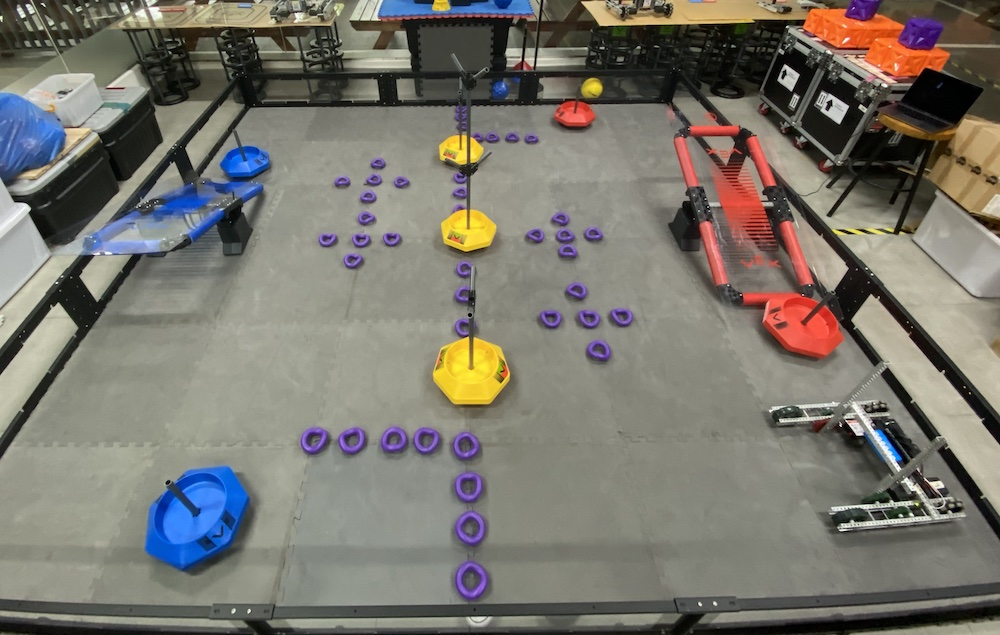
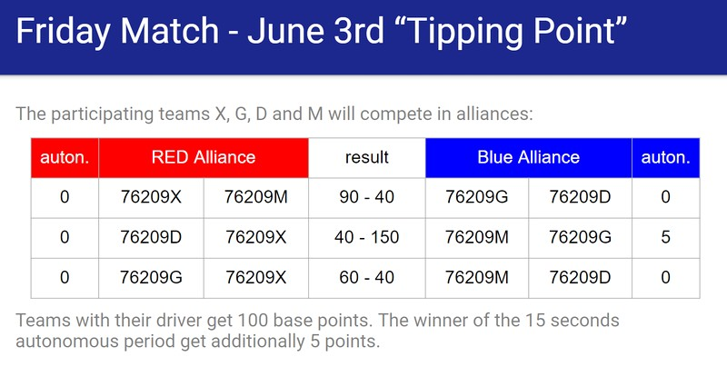
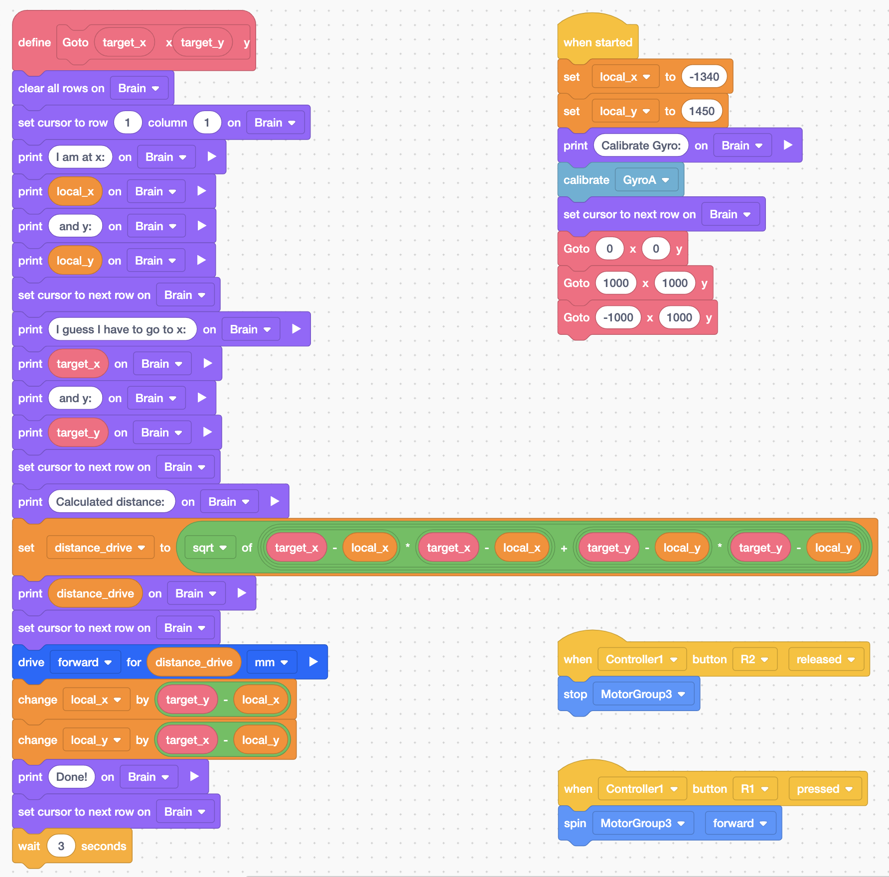
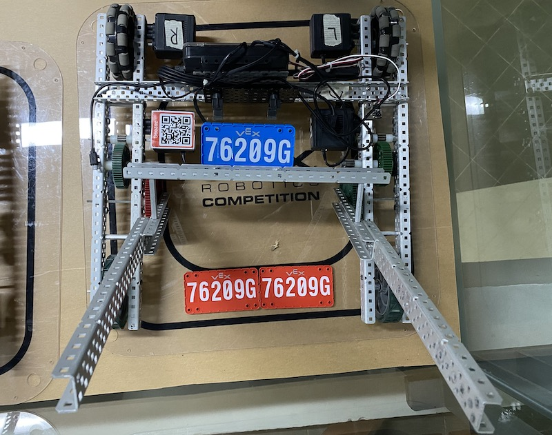
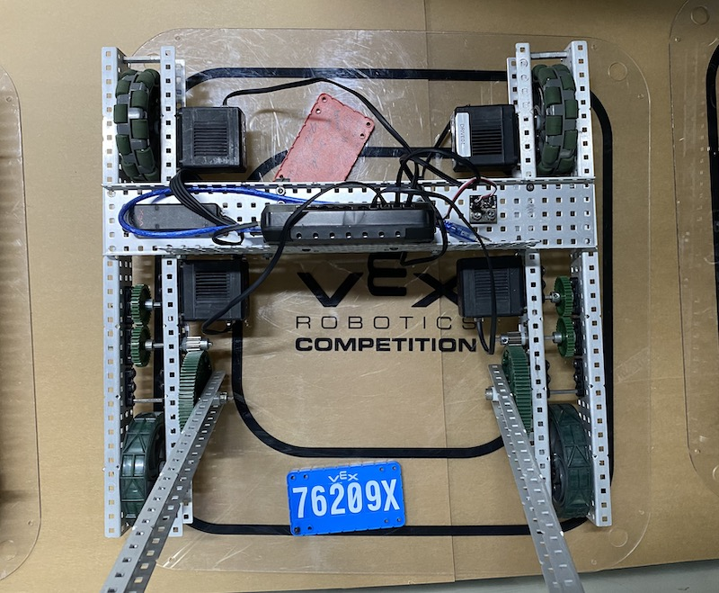
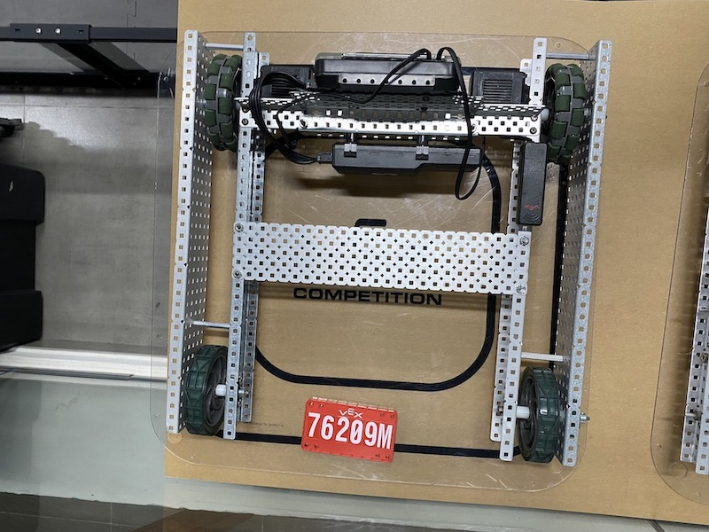
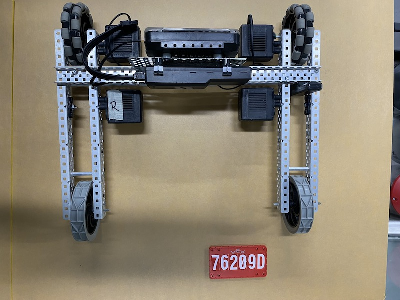
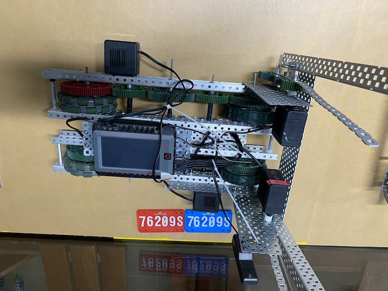
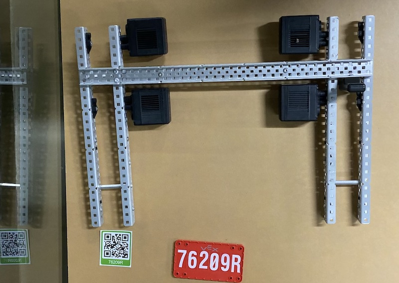

# VEX 2022 at SSIS

The 6 teams of 76209 at Saigon South on "Tipping Point".

- 76209G "Girls rule" with Gipsy Danger
- 76209X "X-Men" with Matador Fury
- 76209S "Seniors" with Vulcan Specter
- 76209D "Dragons" with Nova Hyperion
- 76209M "Masters" with Cherno Alpha
- 76209R "Rookies" with Tacit Ronin

## The final match on June 3rd, 2022

The field was set for the game:



In round 2 the alliance of 76209G and 76209M scored 150 points!



(link to the youtube video with picture)

These are the final scores. There are 100 base points, if the team showed up for this event (only team G and X). And there are additional 5 autonomous points for the winner of the 15 seconds autonomous period. Only team G scored points here during the second match. Finally:

|  Team  | Basepoints | Matchpoints | Autonomous | Sum | Driver |
|:------:|:----------:|:-----------:|:----------:|:---:|:------:|
| 76209G |     100    |  40/150/60  |      5     | 355 |  Tina  |
| 76209X |     100    |   90/40/60  |      0     | 290 |  Khang |
| 76209M |            |  90/150/40  |      5     | 285 | Hawoon |
| 76209D |            |   40/40/40  |      0     | 120 |  Milly |

Congratulations to team G!

## The Teams


## Presentation of last meeting on June 3rd

[Link to the presentation](https://docs.google.com/presentation/d/1GN96e_NtOi18cUoawOQ_z3Wyn68V_QT-zIVcMUL7qGo/edit?usp=sharing)

## Material list
[Link to the Google Sheet](https://docs.google.com/spreadsheets/d/1A7vslx_wU4IpJjLEY3Lfs6Wbv8zcP56oq8BDbfzBZ_A/edit?usp=sharing) 

## Example scripts

The example scripts should test the general working condition of the robot with motors and brain. We have example programs in python and blockcode to check motors or GPS sensor.



Of course it looks better in Python:

``` py
import math

def goto(target_x, target_y, reverse):
    #x1 = gps.x_position(MM)
    #y1 = gps.y_position(MM)
    delta_x = target_x - x1
    delta_y = target_y - y1
    distance = math.sqrt(delta_x**2 + delta_y**2)     # pythagorean theorem
    if ( delta_x == 0 ):
        if ( delta_y < 0):
            direction = 90
        else:
            direction = 270
    else:
        direction = - math.atan(delta_y / delta_x) * 180 / math.pi
    if ( delta_x < 0 ):
        direction = direction + 180
    if ( reverse != 0 ):
        direction = direction + 180
    if ( direction > 360 ):
        direction = direction - 360
    drivetrain.turn_to_heading(direction, DEGREES, wait=True)
    if ( reverse != 0 ):
        drivetrain.drive_for(REVERSE, distance, MM, wait=True)
    else:
        drivetrain.drive_for(FORWARD, distance, MM, wait=True)
def pick_up():
    fork_motor_group.spin_to_position(1500, DEGREES, wait=True)
def set_down():
    fork_motor_group.spin_to_position(1800, DEGREES, wait=True)

def main():
    global myVariable, x1, y1
    x1 = -1400
    y1 = 1320
    goto(0, 0, 0)

# Calibrate the Drivetrain
calibrate_drivetrain()

main()
```

## Pneumatic

If connected to port A the pneumatic piston will expand and collapse every second, counting up with each cycle and printing it on the screen to determine the maximum cycle count (around 40) with a fully charged 100 psi cylinder.

``` py
from vex import *
import urandom

# Brain should be defined by default
brain=Brain()

# Robot configuration code
digital_out_c = DigitalOut(brain.three_wire_port.c)

# wait for rotation sensor to fully initialize
wait(30, MSEC)

#endregion VEXcode Generated Robot Configuration
vexcode_brain_precision = 0
vexcode_console_precision = 0

myVariable = 0

def main():
    global myVariable, vexcode_brain_precision, vexcode_console_precision
    brain.screen.print("Start in 2 seconds")
    brain.screen.next_row()
    wait(2, SECONDS)
    digital_out_c.set(False)
    brain.screen.print("Open in 2 seconds.")
    brain.screen.next_row()
    wait(2, SECONDS)
    brain.screen.print("Open!")
    brain.screen.next_row()
    digital_out_c.set(True)
    wait(2, SECONDS)
    digital_out_c.set(False)
    brain.screen.print("And done")
    wait(2, SECONDS)
    # stop project not currently supported

main()
```

## Just the robots

  

  

