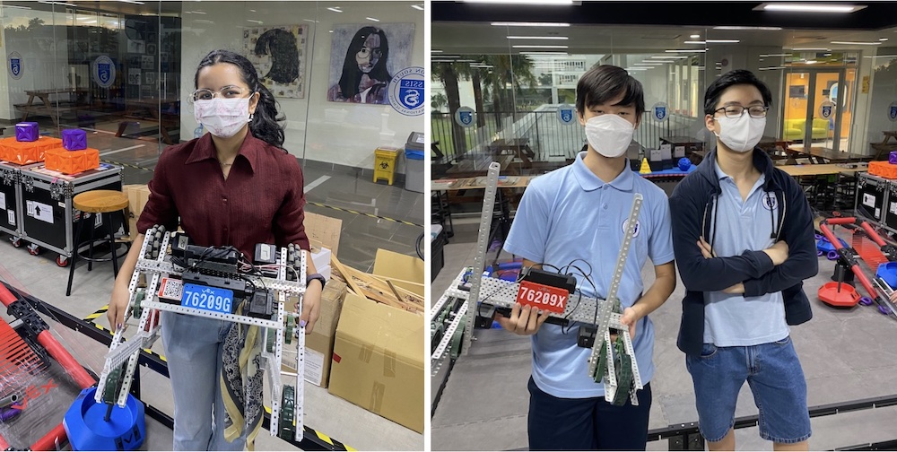
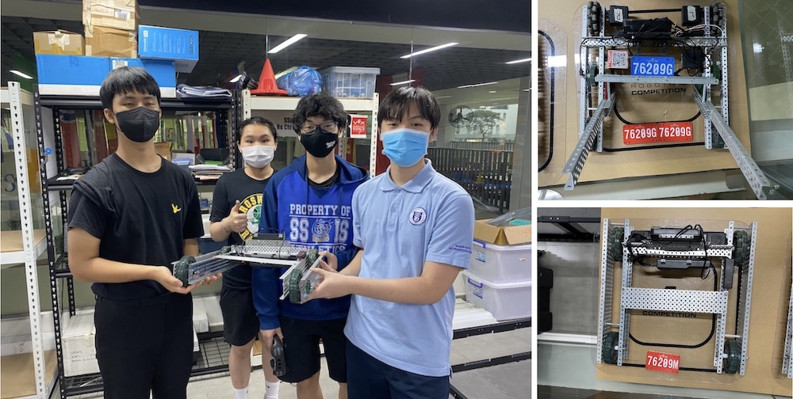
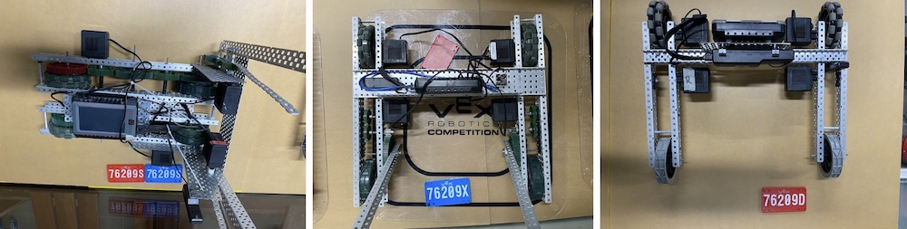

# VEX 2022 at SSIS

The 6 teams of 76209 at Saigon South on "Tipping Point".

- 76209G "Girls rule" with Gipsy Danger
- 76209X "X-Men" with Matador Fury
- 76209S "Seniors" with Vulcan Specter
- 76209D "Dragons" with Nova Hyperion
- 76209M "Masters" with Cherno Alpha
- 76209R "Rookies" with Tacit Ronin

## The match June 3rd, 2022

The field was set for the game:

In round 2 the aliance of 76209G and 76209M scored 150 points!

(link to the youtube video with picture)

## The Teams

## Presentation of last meeting on June 3rd - with a life competition

[Link to the presentation](https://docs.google.com/presentation/d/1GN96e_NtOi18cUoawOQ_z3Wyn68V_QT-zIVcMUL7qGo/edit?usp=sharing)

## Material list
[Link to the Google Sheet](https://docs.google.com/spreadsheets/d/1A7vslx_wU4IpJjLEY3Lfs6Wbv8zcP56oq8BDbfzBZ_A/edit?usp=sharing) 

## Example scripts

The example scripts should test the general working condition of the robot with motors and brain. We have example programs in python and blockcode to check motors or GPS sensor.

## Pneumatic

If connected to port A the pneumatic piston will expand and collapse every second, counting up with each cycle and printing it on the screen to determine the maximum cycle count (around 40) with a fully charged 100 psi cylinder.

More documentation done by students.
