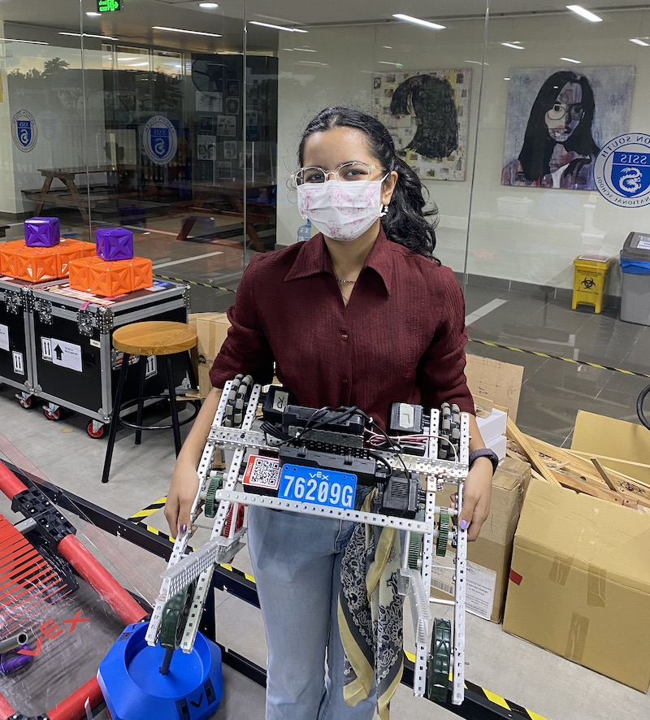
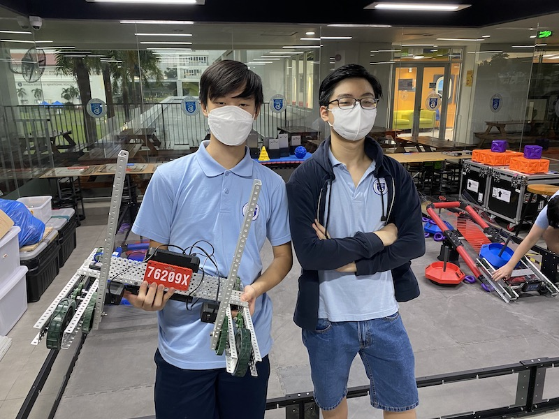
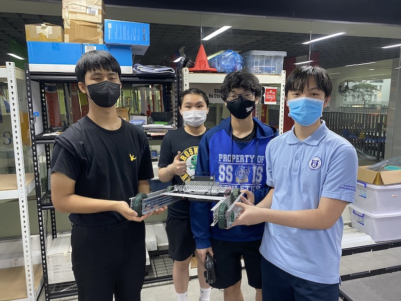

# VEX 2022 at SSIS

From the 6 teams 5 were able to build a driving robot. 4 of them took part in the final match on June 3rd, 2022.

## The match June 3rd, 2022

The field was set for the game:

In round 2 the aliance of 76209G and 76209M scored 150 points!

### [Video of the 2 minute match on YouTube](https://youtu.be/Q6zuzF059VI)

|  Team  | Basepoints | Matchpoints | Autonomous | Sum | Driver |
|:------:|:----------:|:-----------:|:----------:|:---:|:------:|
| 76209G |     100    |  40/150/60  |      5     | 355 |  Tina  |
| 76209X |     100    |   90/40/60  |      0     | 290 |  Khang |
| 76209M |            |  90/150/40  |      5     | 285 | Hawoon |
| 76209D |            |   40/40/40  |      0     | 120 |  Milly |

Congratulations to team G! Great work, the only ones with working autonomous function. Well deserved.

## Team 76209G - Winner 2022

Team members are Tina, Meherika, Milly and Bomin.

 

## Team 76209X - Runners Up 2022

Team members are Khang, Phu, Kenneth, Jerry and Leo.

 

## Team 76209M - Third place 2022

Team members are Hawoon, Vanessa, Danny, Thai, Steven and David.

 

## Team 76209D - The fourth working robot 2022

Team members are Yuseong, Doyun, Tom and Lam.

## Team 76209S - Unique design choices

Team members are Mikel, Anh Minh, Daniel and Khoa.

## Team 76209R - the Rookies

Team members are Ian, Quang, Cheuk Kai and Keng.

## Team overview

The teams of 76209 at Saigon South on "Tipping Point". Our teams:

- 76209G "Girls rule" with Gipsy Danger
- 76209X "X-Men" with Matador Fury
- 76209S "Seniors" with Vulcan Specter
- 76209D "Dragons" with Nova Hyperion
- 76209M "Masters" with Cherno Alpha
- 76209R "Rookies" with Tacit Ronin

## Presentation of last meeting on June 3rd - with a life competition

[Link to the presentation](https://docs.google.com/presentation/d/1GN96e_NtOi18cUoawOQ_z3Wyn68V_QT-zIVcMUL7qGo/edit?usp=sharing)

## Material list
[Link to the Google Sheet](https://docs.google.com/spreadsheets/d/1A7vslx_wU4IpJjLEY3Lfs6Wbv8zcP56oq8BDbfzBZ_A/edit?usp=sharing) 

## Example scripts

The example scripts should test the general working condition of the robot with motors and brain. We have example programs in python and blockcode to check motors or GPS sensor.

## Pneumatic

If connected to port A the pneumatic piston will expand and collapse every second, counting up with each cycle and printing it on the screen to determine the maximum cycle count (around 40) with a fully charged 100 psi cylinder.

More documentation done by students.
